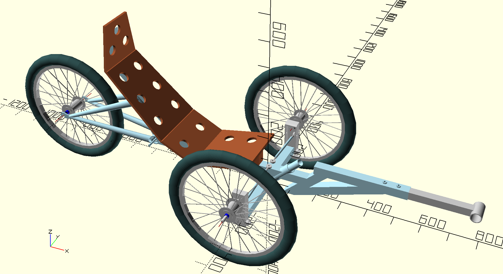

# TriceratopsTwo
Code updates will be made here, but construction updates will happen over at http://clunkerbike.com/ Also, some of my design and artistic opinions might interest you or not at my profile web address, http://shinyhappyrainbows.com/ I've also started constructing a [wiki] (https://github.com/crunchysteve/TriceratopsTwo/wiki), initially to layout my build plan to get a better idea of the problems I'll need to solve and what extra tools I'll need, then eventually work those into construction instructions for others who want to attempt a build.

OpenScad Plans for a lean steering, recumbent, tadpole trike. How it works is demonstrated by the GIF below this main image. Some points to note. 
* I'm using a donor bike for the rear triangle, you will need to design your own rear end or use a donor bike and modify this model. I'll be designing and building my own rear triangle for frame version two. This will probably also be a frame for a shorter person than me, so the pedal bracket and frame front will be shorter. Wheelbase won't change.
* I'm considering an integrated pannier rack. Stronger and a tiny tad lighter than a bolt on.
* The 12° angles on the seat beam and on the pedal bracket beams are for better ergonmics.
* The steering head heaight is now 120mm, making the minimum steerer length 190mm.
* You build and use this machine at your own risk!

# This is how it works.
As the main frame in the center leans, the crossmember tries to find its natural level by turning clockwise for a righthand lean or, counter-clockwise for a lefthand lean, and is able to do this as the steering head is on a 45 degree forward angle. Tie rods between the main frame and tilt brackets, pivoted at each end of the crossmember, tilt the front wheels to lean in unison with the rear wheel. Enjoy this GIF animation as a simplified deomonstration. Building should start in the next month or so.

#Still to be done
* Tidy OpenSCAD code - separate frame and illustrative parts now done, tighter, more mathematical code will be added/improved over time.
* Non-salvaged rear triangle.
* Add ISO disk brake mounts to front wheels.
* Detail some of the handle components and how to modify standard inch 1/8 stems and a drop or bullhorn bar to work as handles on either side of the crossmember.
* Tidy images and provide 2D dimensioned drawings.

## Aggressive Elevational Views
### Front

### Right

### Overhead

