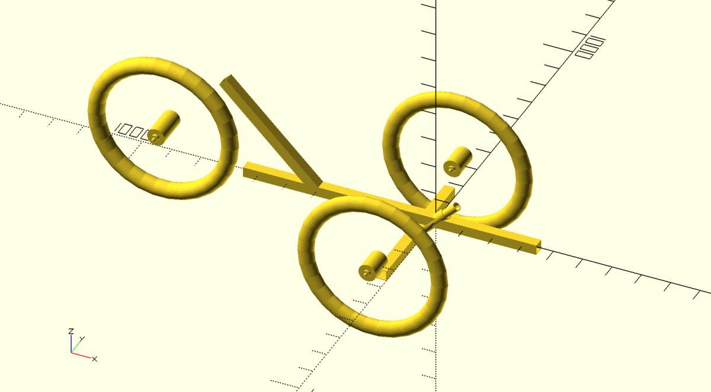
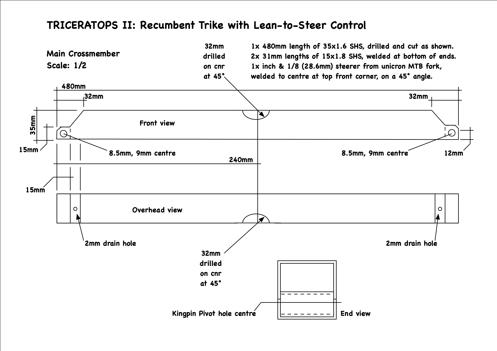
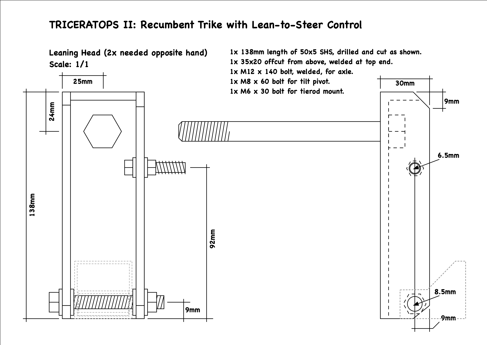

# TriceratopsTwo
OpenScad Plans for a lean steering, recumbent, tadpole trike. Apologies, it's a bit of a hot mess right now, will tidy as I go, but this is what I plan to build will look like. How it works is demonstrated by the GIF below this main image. Some points to note. 
* I'm using a donor bike for the rear triangle, you will need to design your own rear end or use a donor bike and modify this model.
* The Star Trek like "saucer bracket" in front of the steering head is to elevate the crank bracket a little and protect the steering head from collision with a rock, stump or similar obstacle.
* You build and use this machine at your own risk!

# This is how it works.
As the main frame in the center leans, the crossmember tries to find its natural level by turning clockwise for a righthand lean or, counter-clockwise for a lefthand lean, and is able to do this as the steering head is on a 45 degree forward angle. Tie rods between the top edge of the main frame and axle brackets, pivoted at each end of the crossmember, tilt the front wheels to lean in unison with the rear wheel. Enjoy this GIF animation as a implified deomonstration.

#Still to be done
* Tidy OpenSCAD code - there is some lazy coding and I want to break the master model into a list of its parts as include files.
* No-salvaged rear triangle.
* Add ISO disk brake mounts to front wheels.
* Detail some of the handle components and how to modify standard inch 1/8 stems and a drop or bullhorn bar to work as handles on either side of the crossmember.

# 2D drawings
### Main Crossmember

### LeaningHead

