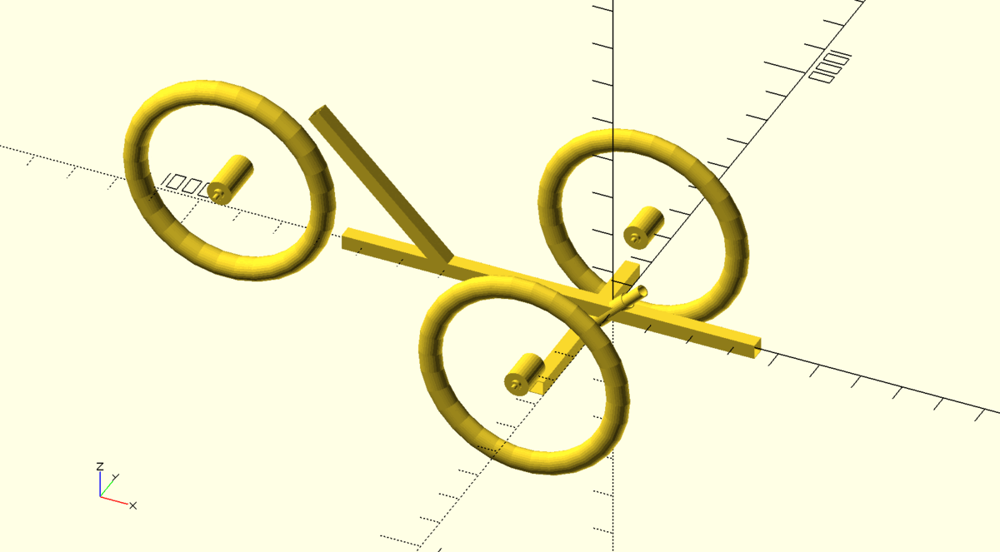

I was going to build this, then some of my circumstances looked like changing, so I hid this repo from public view. They did change and I have just bought a recumbent trike, so this is now a project I'm "clearing out." It's now a public archive and I'll no longer be progressing it. Any and all may feel free to use the plans as they stand, but no guarantees of reliability or ridability can be made as nothing was ever built. To use them for a project of your own, fork them to your account and you'll be able to modify or edit the openSCAD design to your heart's content. I'd prefer you don't use this design commercially with discussing it with me first, maybe considering a royalty, but personal use is free and "open slather."

Cheers,
Crunchy.

***

# TriceratopsTwo
Code updates will be made here, but construction updates will happen over at http://clunkerbike.com/ Also, some of my design and artistic opinions might interest you or not at my profile web address, http://shinyhappyrainbows.com/

OpenScad Plans for a lean steering, recumbent, tadpole trike. How it works is demonstrated by the GIF below this main image. Some points to note. 
* I'm using a donor bike for the rear triangle, you will need to design your own rear end or use a donor bike and modify this model.
* You build and use this machine at your own risk!

# This is how it works.
As the main frame in the center leans, the crossmember tries to find its natural level by turning clockwise for a righthand lean or, counter-clockwise for a lefthand lean, and is able to do this as the steering head is on a 45 degree forward angle. Tie rods between the top edge of the main frame and axle brackets, pivoted at each end of the crossmember, tilt the front wheels to lean in unison with the rear wheel. Enjoy this GIF animation as a simplified deomonstration.

#Still to be done
* Tidy OpenSCAD code - separate frame and illustrative parts now done, tighter, more mathematical code will be added/improved over time.
* Non-salvaged rear triangle.
* Add ISO disk brake mounts to front wheels.
* Detail some of the handle components and how to modify standard inch 1/8 stems and a drop or bullhorn bar to work as handles on either side of the crossmember.
* Tidy images and provide 2D dimensioned drawings.

## Aggressive Elevational Views
It's unlikely that a rider would ever need to corner this machine this tightly. Can you corner a bicycle inside a 2m radius? (Well, maybe some stunters can, but it's not common commuter or mixed traffic usage.) Also, not noticed at the time of creating these "extremes", the back wheel, in leaning, tilts the trike slightly backwards, as well. This has front traction and wheel loading benefits - a happy accident. It probably also makes the back end traction slightly "loose", like a classic, rear wheel drive sports car.
### Front

### Right

### Overhead

